# Elite Estate

A series of code used for understanding the behaviour of different variables in Madrid's Real Estate

# Table of contents
1. [Description](#Description)
2. [Installation](#Installation)
3. [Usage](#Usage)
7. [Authors](#Authors)
9. [License](#License)

## Description

Elite Estate is a Spanish data analytics firm based on collecting and interpreting data from the housing market. This project aims to identify the most relevant variables affecting the price of houses and their specific impact on it. For carrying this out, the dataset ['houses_Madrid.csv'](https://www.kaggle.com/datasets/mirbektoktogaraev/madrid-real-estate-market/) was thoroughly analysed. Then, diverse plots were designed for offering a grpahical representation of the data in order to facilitate the understanding of specific variables. To end, the program designed a price predictor using OOP programming, which it takes as input variables such as the number of rooms, bathrooms, square meters and the presence of a parking, and calculates the predicted price according to the data analysed.

## Installation & Usage

The program provides two ways for visualizing the code that contains the data analytics of Madrid's real estate market; from Google Collab or directly in Python.

- [Python installation](#PythonInstallation)
- [Google Collab instalation](#GoogleCollabInstallation)


### Python Installation
Firstly, install [Python](https://www.python.org/downloads/) and [PyCharm](https://www.jetbrains.com/pycharm/download/).

Once you have installed both programs you are ready to begin seeing Elite Estate analysis.

The first step you need to follow is to create a folder in your computer in a place you will remember. This is very important, as you will need to save the data frame 'houses_Madrid.csv' in the same folder / environment. It is recommended to create a folder on the desktop of your computer for easy access

Files >> Desktop >> 'Right Click' >> New Folder >> type: 'Elite Estate'

Once you have created this folder, create a Pycharm environment in this folder. Follow the next steps to do it correctly. The software in the steps is MacOS but in Windows is almost the same, but you may encounter some interface difference

Step 1: Open PyCharm and create a 'New Project'
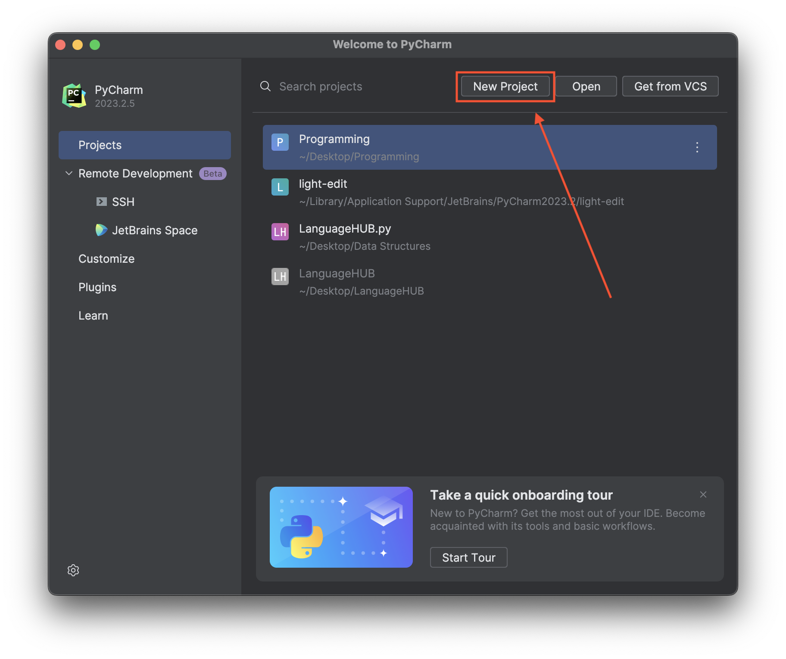

Step 2: Change the project directory to the folder you previously created
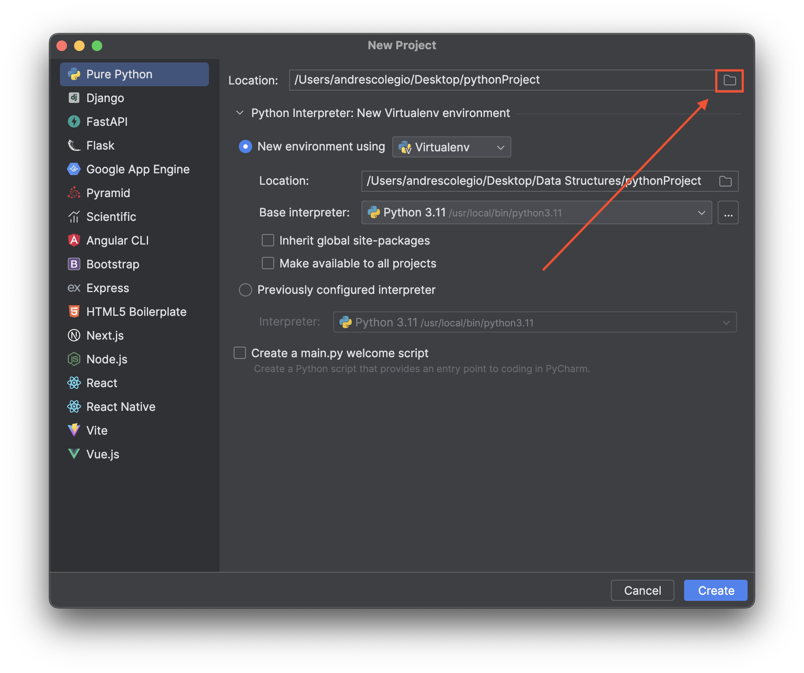

Step 3: Select the folder you created before as your PyCharm project directory
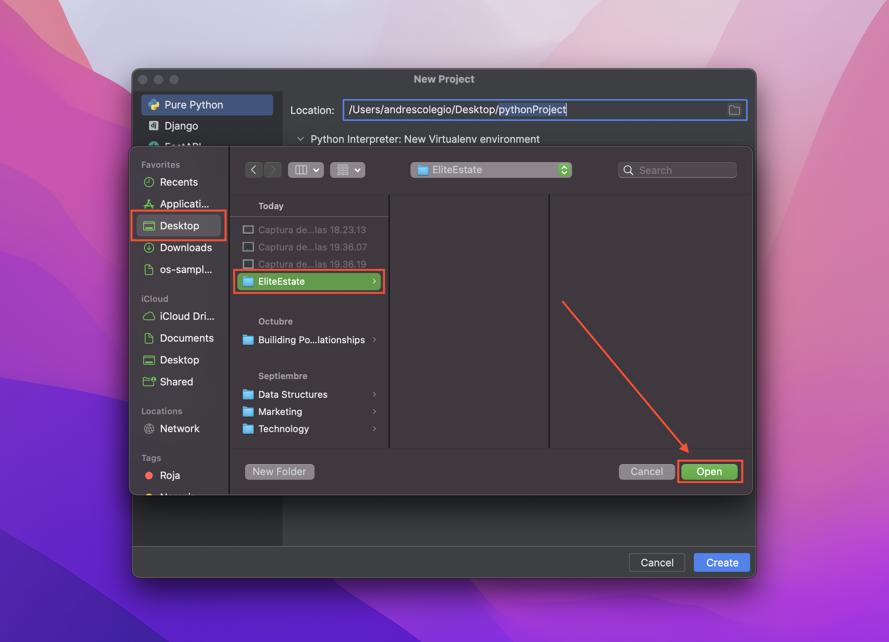

Step 4: Create the project
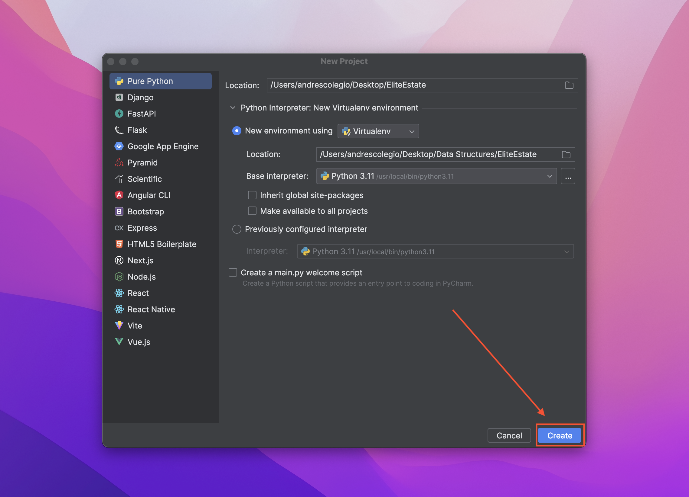

Step 5: The outlook of the environment
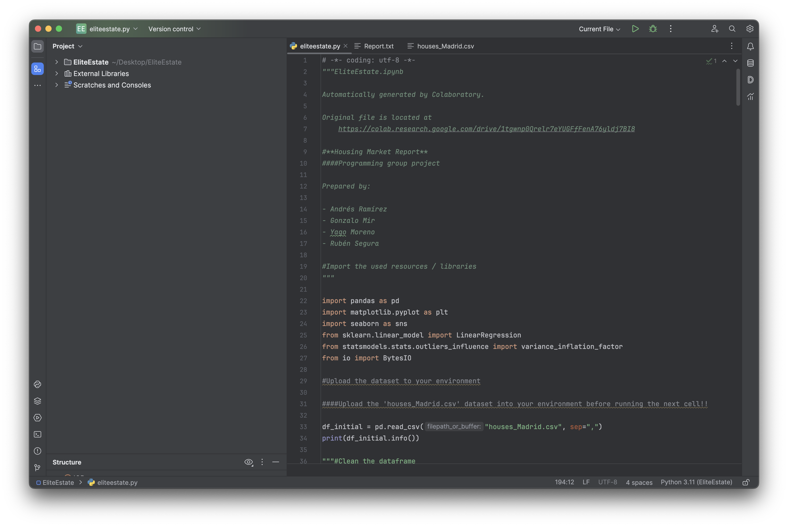

Download the 'requirements.txt' and the 'eliteestate.py' files. Save them in the same folder for better organisation. 

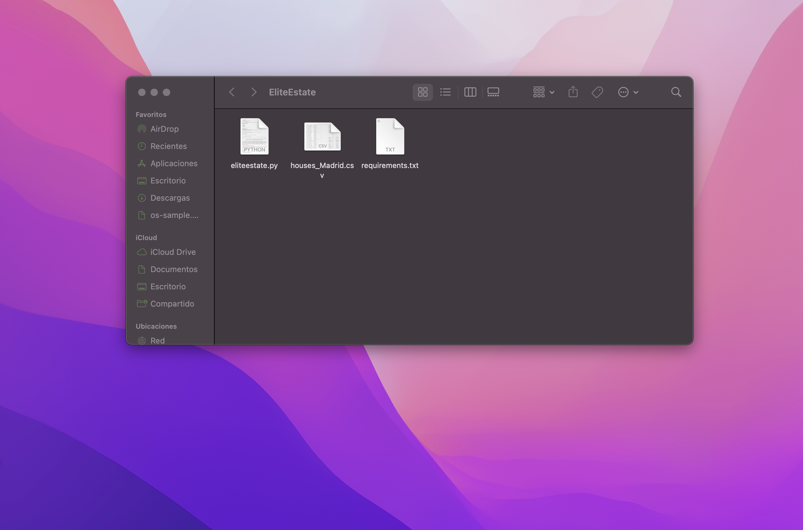

The next step is the final one. Open the 'EliteEstate.py' file which is the one containing the program with PyCharm.

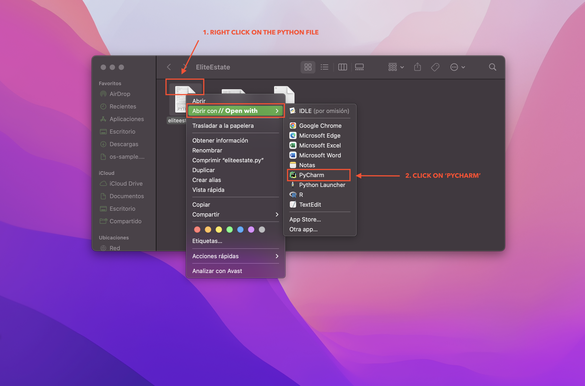

After this, install the requirements in your Pycharm terminal.

```python
pip install -r requirements.txt
```
Warning: 
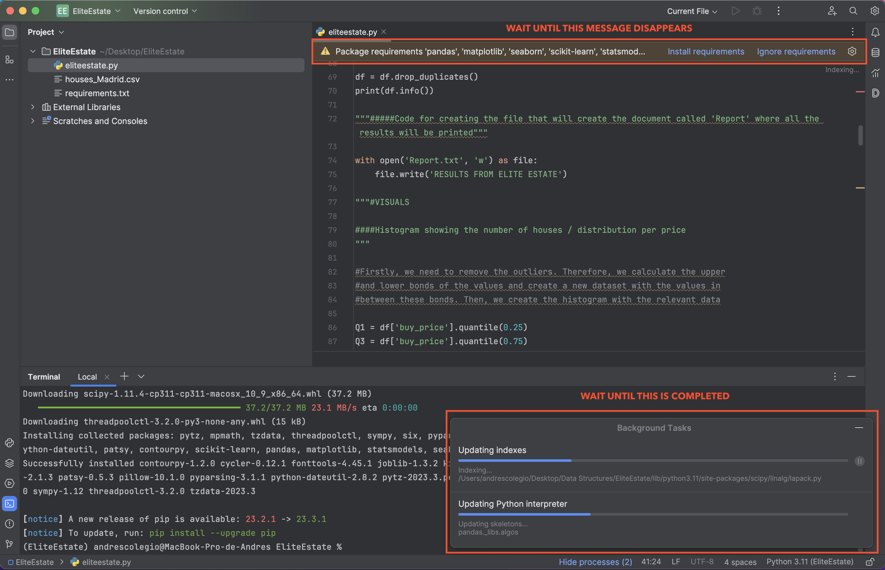

Once the python environment looks like this, you are ready tu run the code.

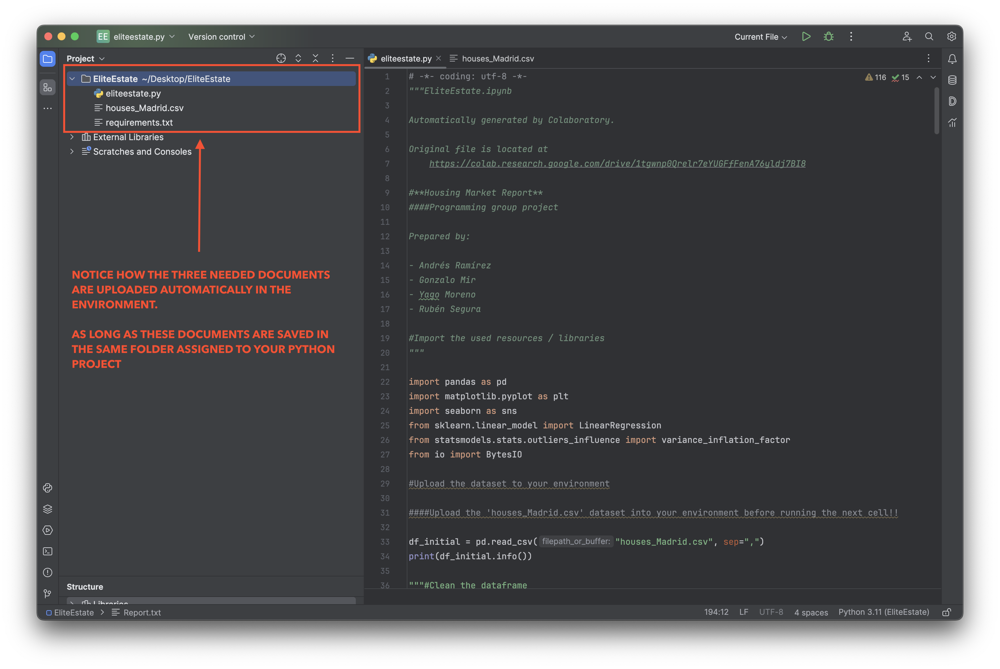

Once the code has been run and the questionnaire completed, a file called 'Results.txt' will be saved to your environment with the relevant numerical calculation of each plot. You should find this document in your environment folder and it should look like this:

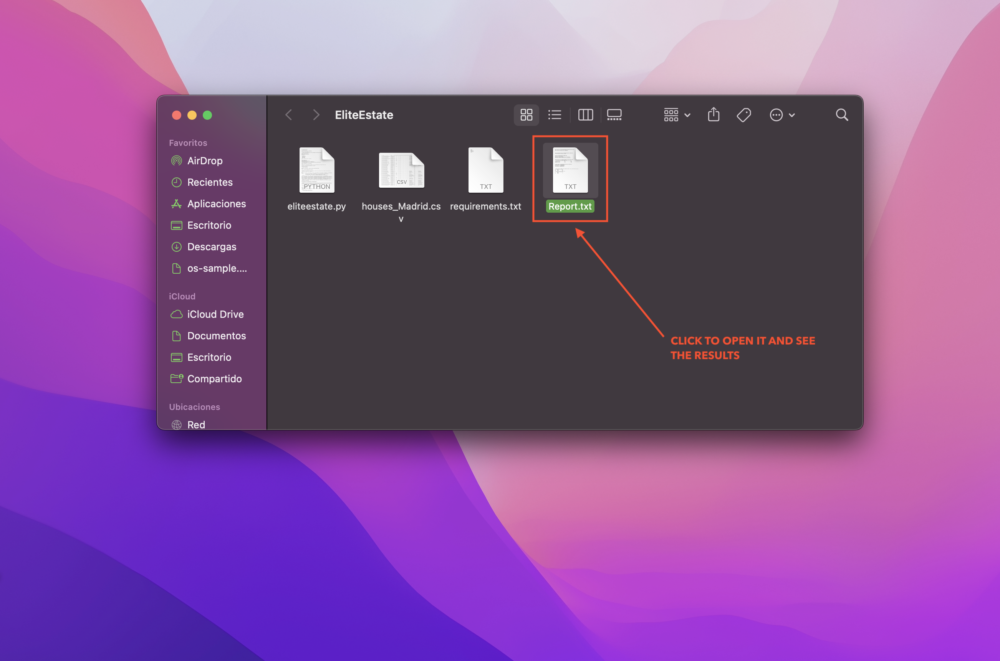

That would be all. Thank you for seeing our analysis!

### Google Collab Installation

Download the 'EliteEstate.ipynb' file from the 'main' directory in this GitHub and have it located

After this, you will need to visit [Google Drive](https://www.google.com/drive/) and sign in and T

hese images explain how to upload the 'EliteEstate.ipynb' document to 'Your Drive' and open it with Google Collab.

Step 1: 

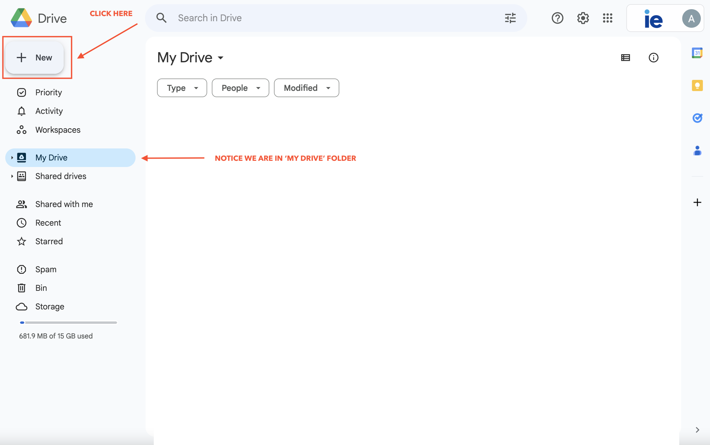

Step 2: 

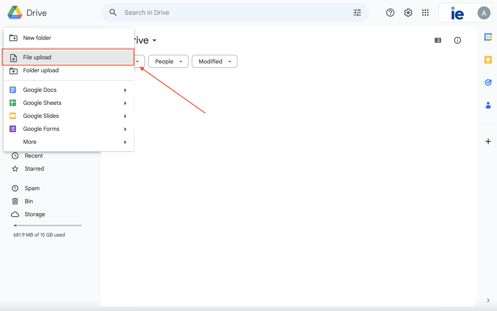

Step 3: 

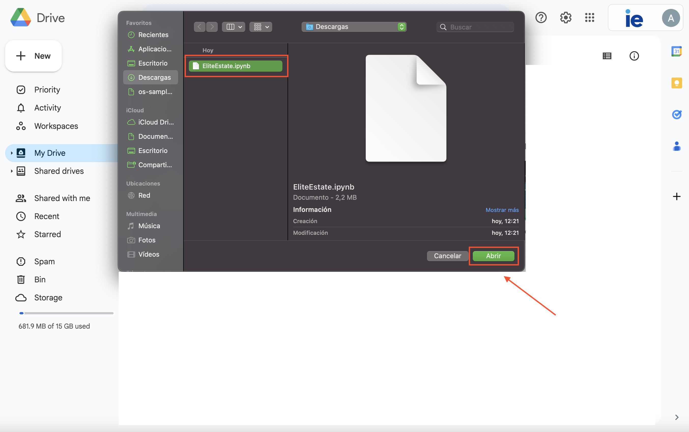

Step 4: 

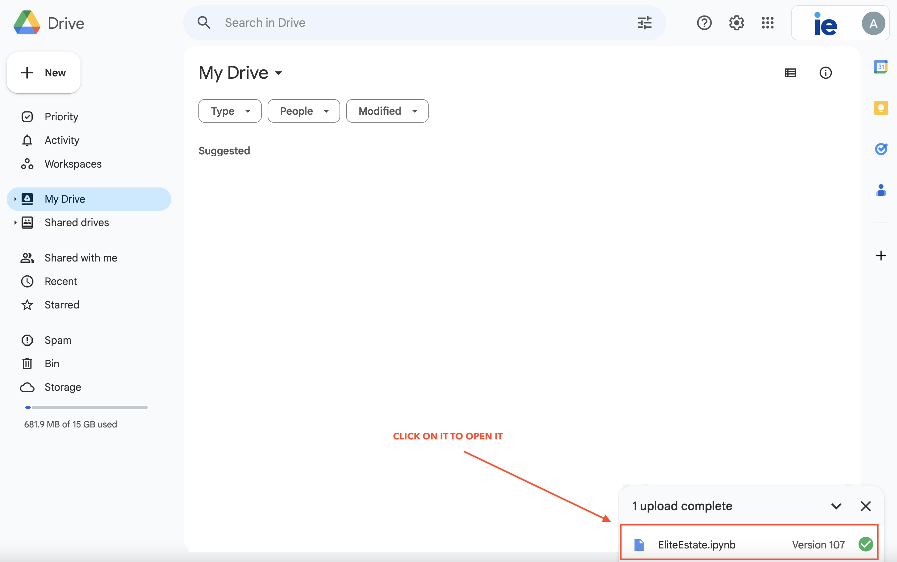

If everything was done correctly, your screen should look like this:

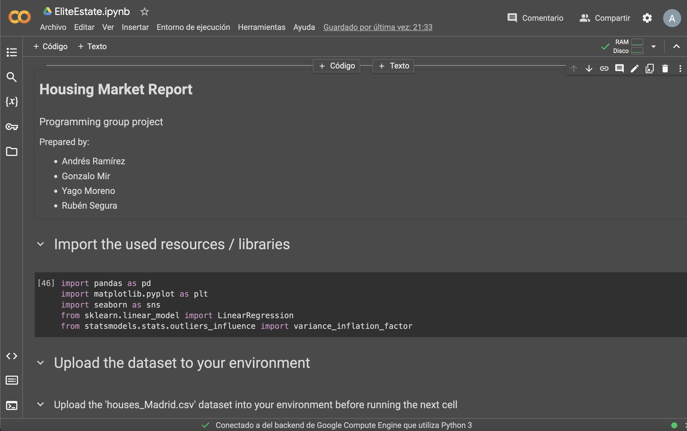

Now, follow the instructions shown in the file to upload the data frame 'madrid_Houses.csv' into your environment.

From here, run the cells in their respective order and you will be able to see the abalysis carried out.


## Authors
Rubén Segura: [Github](https://github.com/rubensegu)

Gonzalo Mir: [Github](https://github.com/gonzalomirr)

Yago Moreno: [Github](https://github.com/ymoreno2022)

Andrés Ramírez: [Github](https://github.com/andresramirezzz)

## License

Copyright (c) [2023] [Elite Estate]

Permission is hereby granted, free of charge, to any person obtaining a copy
of this software and associated documentation files (the "EliteEstate.py"), to deal
in the Software without restriction, including without limitation the rights
to use, copy, modify, merge, publish, distribute, sublicense, and/or sell
copies of the Software, and to permit persons to whom the Software is
furnished to do so, subject to the following conditions:

The above copyright notice and this permission notice shall be included in all
copies or substantial portions of the Software.

THE SOFTWARE IS PROVIDED "AS IS", WITHOUT WARRANTY OF ANY KIND, EXPRESS OR
IMPLIED, INCLUDING BUT NOT LIMITED TO THE WARRANTIES OF MERCHANTABILITY,
FITNESS FOR A PARTICULAR PURPOSE AND NONINFRINGEMENT. IN NO EVENT SHALL THE
AUTHORS OR COPYRIGHT HOLDERS BE LIABLE FOR ANY CLAIM, DAMAGES OR OTHER
LIABILITY, WHETHER IN AN ACTION OF CONTRACT, TORT OR OTHERWISE, ARISING FROM,
OUT OF OR IN CONNECTION WITH THE SOFTWARE OR THE USE OR OTHER DEALINGS IN THE
SOFTWARE.
